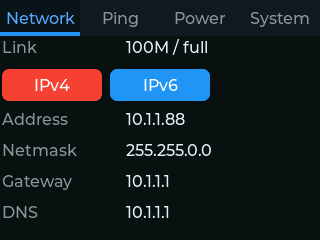
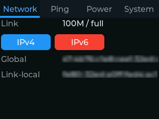
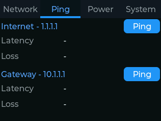
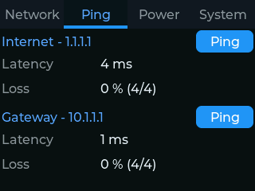
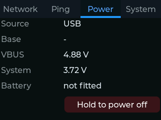
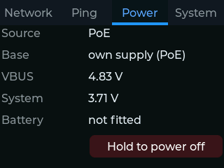
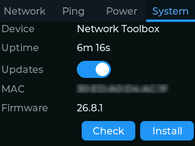

# Network Toolbox

ESPHome firmware for handheld network test gear. Plug a device into an unknown
network and read back what that network gives you: link speed and duplex,
whether DHCP answered, the address, netmask, gateway, DNS and IPv6 it handed
out, and live latency and loss to the gateway and the internet.

# Screens

  

    
    
    
    
    
    
    
  

  

    <button type="button" class="carousel-btn" data-step="-1" aria-controls="carousel" aria-label="Previous screenshot">&#8592;</button>
    

    <button type="button" class="carousel-btn" data-step="1" aria-controls="carousel" aria-label="Next screenshot">&#8594;</button>
  

<noscript>
  
</noscript>

# Installation

You can use the button below to install the pre-built firmware directly to your
device via USB from the browser.

<esp-web-install-button manifest="firmware/network-toolbox.manifest.json"></esp-web-install-button>

